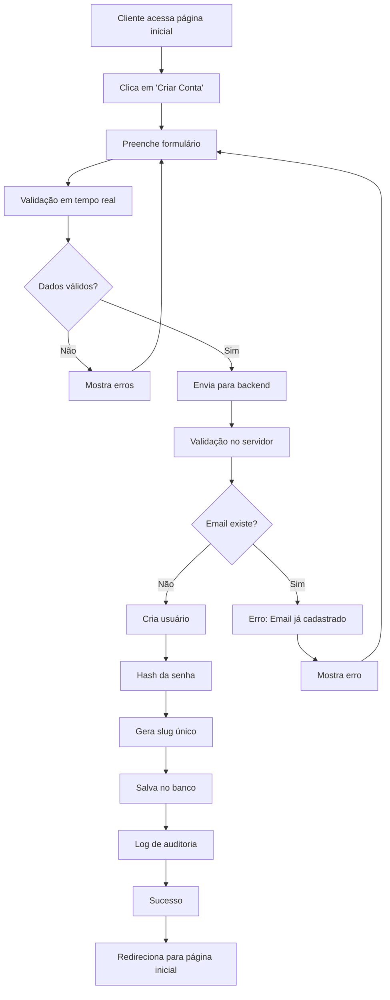

# Sistema de Cadastro Automático - Up.Baloes

## Visão Geral

O sistema de cadastro automático permite que clientes se cadastrem diretamente no sistema sem necessidade de intervenção do administrador. Após o cadastro, o usuário é automaticamente redirecionado para a página inicial.

## Funcionalidades Implementadas

### 1. Página de Cadastro (`pages/cadastro.html`)
- Formulário completo com validação em tempo real
- Campos obrigatórios: Nome, Email, Senha, Confirmação de Senha
- Campos opcionais: Telefone, Endereço, Cidade, Estado, CEP
- Validação de termos e condições
- Máscaras para telefone e CEP
- Toggle de visibilidade para senhas
- Design responsivo e moderno

### 2. Serviço PHP (`services/cadastro.php`)
- Validação completa dos dados de entrada
- Verificação de email duplicado
- Hash seguro da senha
- Geração automática de slug único
- Log de cadastros para auditoria
- Limite de tentativas por IP (5 por dia)
- Tratamento de erros robusto

### 3. JavaScript (`js/cadastro.js`)
- Validação em tempo real dos campos
- Máscaras automáticas para telefone e CEP
- Feedback visual para validação
- Integração com o backend PHP
- Redirecionamento automático após sucesso

### 4. Integração com Sistema Existente
- Link de cadastro na página de login
- Botão de cadastro na página inicial
- Estilos CSS consistentes
- Navegação fluida entre páginas

## Estrutura do Banco de Dados

### Campos Adicionados à Tabela `usuarios`:
```sql
ALTER TABLE usuarios 
ADD COLUMN telefone VARCHAR(20) NULL AFTER email,
ADD COLUMN endereco TEXT NULL AFTER telefone,
ADD COLUMN cidade VARCHAR(100) NULL AFTER cidade,
ADD COLUMN estado VARCHAR(2) NULL AFTER estado,
ADD COLUMN cep VARCHAR(10) NULL AFTER cep,
ADD COLUMN slug VARCHAR(100) UNIQUE NULL AFTER cep;
```

### Scripts SQL Disponíveis:
- `database/adicionar_campo_slug_usuarios.sql` - Adiciona campo slug
- `database/atualizar_tabela_usuarios.sql` - Atualiza estrutura da tabela

## Como Usar

### Para Clientes:
1. Acesse a página inicial do sistema
2. Clique em "Criar Conta" ou "Criar Nova Conta"
3. Preencha o formulário de cadastro
4. Aceite os termos e condições
5. Clique em "Criar Conta"
6. Aguarde a confirmação e redirecionamento automático

### Para Administradores:
1. Execute os scripts SQL necessários no banco de dados
2. Verifique se o serviço PHP está funcionando
3. Monitore os logs de cadastro em `access_logs`
4. Gerencie usuários através do painel administrativo

## Segurança

### Medidas Implementadas:
- Hash seguro de senhas (PHP password_hash)
- Validação de entrada (sanitização)
- Limite de tentativas por IP
- Verificação de email duplicado
- Logs de auditoria
- Headers de segurança

### Validações:
- Nome: mínimo 2 caracteres
- Email: formato válido e único
- Senha: mínimo 6 caracteres
- Telefone: 10 ou 11 dígitos (opcional)
- CEP: 8 dígitos (opcional)

## Fluxo de Cadastro



## Arquivos Modificados/Criados

### Novos Arquivos:
- `pages/cadastro.html` - Página de cadastro
- `js/cadastro.js` - JavaScript para cadastro
- `services/cadastro.php` - Serviço PHP para cadastro
- `database/adicionar_campo_slug_usuarios.sql` - Script SQL
- `docs/sistema-cadastro-automatico.md` - Esta documentação

### Arquivos Modificados:
- `pages/login.html` - Adicionado link para cadastro
- `index.html` - Adicionado botão de cadastro
- `css/login.css` - Adicionados estilos de validação

## Configuração

### Pré-requisitos:
1. PHP 7.4+ com PDO MySQL
2. Banco de dados MySQL/MariaDB
3. Servidor web (Apache/Nginx)

### Configuração do Banco:
1. Execute o script `database/adicionar_campo_slug_usuarios.sql`
2. Verifique se a tabela `usuarios` tem todos os campos necessários
3. Confirme se os índices foram criados

### Configuração do Servidor:
1. Verifique se o PHP pode conectar ao banco de dados
2. Confirme se as permissões de escrita estão corretas
3. Teste o serviço `services/cadastro.php`

## Testes

### Cenários de Teste:
1. **Cadastro com sucesso**: Dados válidos, email único
2. **Email duplicado**: Tentar cadastrar email já existente
3. **Dados inválidos**: Campos obrigatórios vazios
4. **Validação de senha**: Senhas diferentes na confirmação
5. **Limite de tentativas**: Múltiplas tentativas do mesmo IP

### Como Testar:
1. Acesse `http://localhost/Up.BaloesV3/pages/cadastro.html`
2. Teste cada cenário listado acima
3. Verifique os logs no banco de dados
4. Confirme o redirecionamento após sucesso

## Manutenção

### Monitoramento:
- Verificar logs de erro em `logs/error.log`
- Monitorar tentativas de cadastro em `access_logs`
- Acompanhar performance do banco de dados

### Atualizações:
- Manter validações atualizadas
- Revisar limites de segurança
- Atualizar mensagens de erro conforme necessário

## Suporte

Para dúvidas ou problemas:
1. Verifique os logs de erro
2. Confirme a configuração do banco de dados
3. Teste a conectividade PHP-MySQL
4. Valide as permissões de arquivo

---

**Data de Implementação**: Dezembro 2024  
**Versão**: 1.0  
**Status**: Implementado e Funcional
